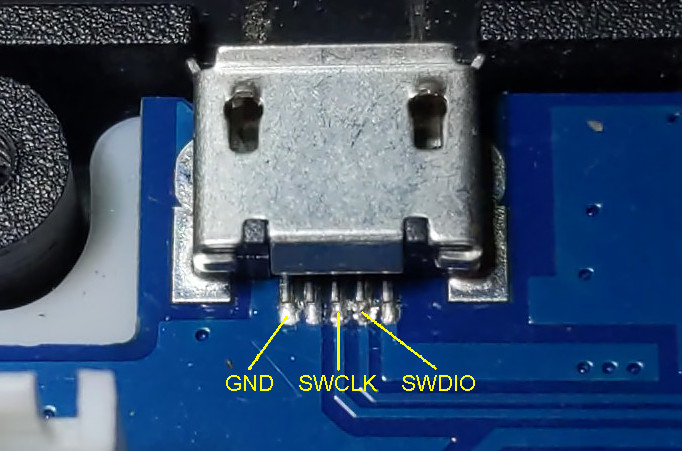
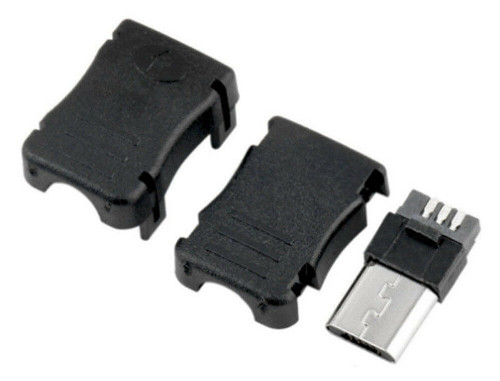
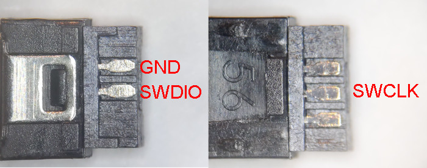
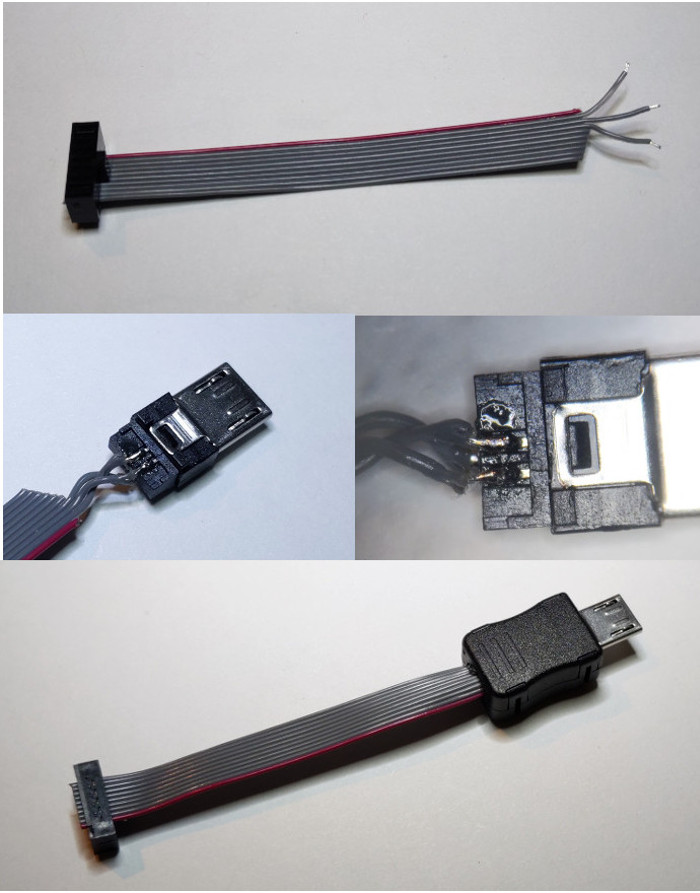

# Programming

## Electrical Connections

USB connector of the FNIRSI-5012H has standard ARM SWD programming pins exposed on
the data lines. The pinout of the connector is shown below.

I used a Micro-USB connector like this:

Search eBay for "Micro USB 5 Pins Male Connector Port Solder Plug" to get a lot
of offers. They all are essentially the same, pick whichever is cheaper.

You can also use a cut off Micro-USB cable. But keep in mind that USB connector 
on the FNIRSI-5012H is recessed, so normal USB cables may not fully insert.
In this case you can remove some of the plastic of the casing.

The connector mentioned above is long enough and does not need any modifications.
Pinout of this connector is as follows:

Here are some pictures of the cable I'm using:

Keep the cable length from the USB connector to the debugger short.
Ideally it should be under 5". Don't use the full length of the USB cable
if you go that route.

## Entering Programming Mode

Without a reset connection, SWD interface on this device is a bit temperamental,
especially is ADC is running. To overcome this, there is a programming
mode, which makes sure that device does not initialize any of the fast running
clocks.

To enter the programming mode, hold F2 button while powering on the device.
Display will remain dark and device will not show that it is powered in any way.
This is normal and expected.

Current version of the firmware will also stop the clocks if you press F2 while
device is running. This is done for easy programming while debugging and
because F2 is not used at this time.
You can disable this behaviour in the buttons_handler() function in the main.c file.

## Programmer Hardware

You will need any SWD-capable programmer. I sell one [here](https://www.tindie.com/products/ataradov/cmsis-dap-compliant-swd-debugger/),
but there are many options out there, pick one that works for you.

It is important to keep in mind that programmers supporting multiple target
voltages often use level shifters powered by the reference voltage provided
by the target board. In this case there is no reference voltage, so you
would need to provide that voltage (+3.3V) externally.

## Programmer Software

Use whatever software works with your programmer and supports GD32F407VET6. 

Open-OCD will probably work, so will [edbg](https://github.com/ataradov/edbg)
if you are using CMSIS-DAP-compliant programmer.

